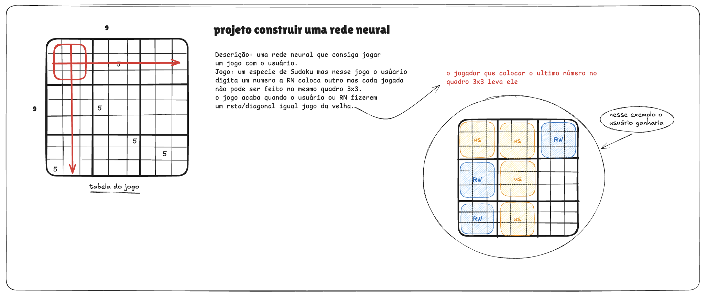

# Sudoku-Toe

Sudoku-Toe é um jogo experimental criado para estudar **redes neurais, tomada de decisão em jogos e desenvolvimento de sistemas inteligentes**.

O projeto combina ideias de **Sudoku** e **jogo da velha**, criando um ambiente onde um usuário joga contra uma rede neural que aprende estratégias ao longo do tempo.

---

# Objetivo do Projeto

O principal objetivo deste projeto é servir como um **ambiente de aprendizado** para estudar:

- Redes neurais
- Sistemas de decisão em jogos
- Treinamento de agentes
- Desenvolvimento de IA aplicada

O jogo funciona como um **ambiente controlado para experimentação com machine learning**.

---

# Como o jogo funciona

O Sudoku-Toe utiliza um tabuleiro dividido em **9 quadros (3x3)**, semelhantes ao Sudoku.

Cada quadro também possui um **grid interno** onde os números são colocados.

---

# Regras principais

1. O usuário recebe uma quantidade de números.
2. O usuário realiza uma jogada colocando um número no tabuleiro.
3. A rede neural responde colocando outro número.
4. Uma jogada **não pode repetir**:
   - o mesmo quadro 3x3  
5. O jogo termina quando:
   - o usuário ou a rede neural completam **uma linha, coluna ou diagonal de quadros** (similar ao jogo da velha).

O jogador que colocar o **último número que completa a linha vence**.

---

# Objetivo da Rede Neural

A rede neural deve aprender a:

- escolher a melhor posição para jogar
- bloquear vitórias do usuário
- identificar padrões de vitória
- maximizar suas chances de ganhar

---

# Status do Projeto

Em desenvolvimento.

Este projeto está em fase inicial.

1 - cria a lógica do jogo <-- O projeto está aqui 
2 - criar a rede neural 
3 - treinar a rede neural 

---

# Motivação

Este projeto foi criado como parte do estudo em **Ciência da Computação e pesquisa em dados**, com foco em entender melhor como modelos de IA tomam decisões em **ambientes estruturados como jogos**.